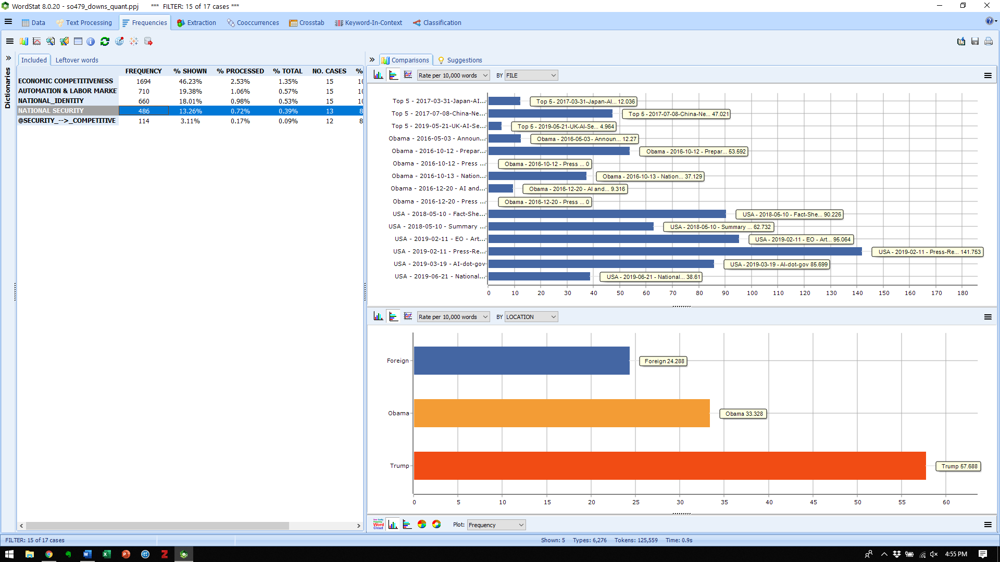

# ai-policy-cda

In August 2019, I performed a critical discourse analysis on AI policy communications from the current US administration and supplemented that qualitative analysis with limited quantitative text analysis methods. The results are below, the texts can be found at [texts](/texts), and the word categorization model for WordStat 8.0 can be downloaded [here](https://github.com/taylordowns2000/ai-policy-cda/blob/master/securitization-tech-policy.wmodel)

## mentions by corpus
| CORPUS  | ECONOMIC COMPETITIVENESS | AUTOMATION & LABOR MARKET | NATIONAL_IDENTITY | NATIONAL SECURITY | @SECURITY_-->_COMPETITIVE |
|---------|--------------------------|---------------------------|-------------------|-------------------|---------------------------|
| Foreign | 254.839                  | 30.45                     | 21.75             | 24.288            | 7.25                      |
| Obama   | 74.988                   | 87.652                    | 31.328            | 33.328            | 6.666                     |
| Trump   | 142.507                  | 25.815                    | 108.527           | 57.688            | 14.224                    |

## mentions by document
| Date       | Name                                                | CORPUS  | ECONOMIC COMPETITIVENESS | AUTOMATION & LABOR MARKET | NATIONAL IDENTITY | NATIONAL SECURITY | SECURITY BEFORE COMPETITION |
|------------|-----------------------------------------------------|---------|--------------------------|---------------------------|-------------------|-------------------|-----------------------------|
| 2016-05-03 | Announcement - Preparing for the Future of AI       | Obama   | 49.0797546               | 27.48588957               | 36.80981595       | 12.26993865       | 0                           |
| 2016-10-12 | Preparing For the Future of AI                      | Obama   | 73.92007392              | 32.25433125               | 18.94201894       | 53.59205359       | 12.47401247                 |
| 2016-10-12 | Press Release on AI Reports                         | Obama   | 110.3448276              | 46.31586207               | 82.75862069       | 0                 | 0                           |
| 2016-10-13 | National AI R&D Strategy                            | Obama   | 61.31863186              | 16.77227723               | 25.3150315        | 37.12871287       | 5.625562556                 |
| 2016-12-20 | AI and the Economy                                  | Obama   | 89.86793797              | 217.7868376               | 47.67384514       | 9.315578936       | 1.643925695                 |
| 2016-12-20 | Press Release on Automation Report                  | Obama   | 62.5                     | 296.425                   | 75                | 0                 | 0                           |
| 2017-03-31 | Japan-AI-Technology-Strategy                        | Foreign | 209.7661623              | 21.44325997               | 18.9133425        | 12.03576341       | 1.719394773                 |
| 2017-07-08 | China-New-Generation-of-AI-Development-Plan         | Foreign | 215.4398564              | 34.90903651               | 23.08284175       | 47.02060357       | 14.5336411                  |
| 2018-05-10 | Fact-Sheet-AI-For-The-American-People               | Trump   | 255.6390977              | 47.34887218               | 105.2631579       | 90.22556391       | 30.07518797                 |
| 2018-05-10 | Summary of AI Summit                                | Trump   | 239.3122677              | 49.06575279               | 178.9033457       | 62.73234201       | 18.58736059                 |
| 2019-02-11 | EO - Artificial Intelligence                        | Trump   | 127.9707495              | 29.48043876               | 131.6270567       | 95.06398537       | 40.21937843                 |
| 2019-02-11 | Press-Release-on-EO-Accelerating-America            | Trump   | 257.7319588              | 43.93041237               | 360.8247423       | 141.7525773       | 77.31958763                 |
| 2019-03-19 | AI-dot-gov                                          | Trump   | 187.4665238              | 50.50321371               | 171.3979646       | 85.69898232       | 18.74665238                 |
| 2019-05-21 | UK-AI-Sector-Deal                                   | Foreign | 326.6157054              | 31.15893974               | 21.84056388       | 4.963764519       | 1.985505808                 |
| 2019-06-21 | National-AI-Research-and-Development-Strategic-Plan | Trump   | 102.6572791              | 11.4096298                | 61.77606178       | 38.61003861       | 5.905064729                 |
